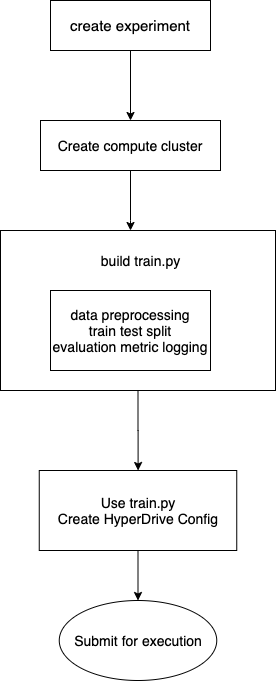

# Optimizing an ML Pipeline in Azure

## Overview

(This project is part of the Udacity Azure ML Nanodegree.)\
In this project, we build and optimize an Azure ML pipeline using the Python SDK and a provided Scikit-learn model in Azure ecosystem.
This model is then compared to an Azure AutoML run on the same problem. This project serves as a prime example of running machine learning tasks on a well-known cloud service provider 

## Summary

In this project, we seek to use 20 different demographical and event-related features to predict whether the user will eventually subscribe a term deposit. We will use sklearn's logistic regression framework, and tune its hyperparameters with HyperDrive. We will also utilize Azure's autoML feature to find us the best model for the bank marketing prediction problem.

## Dataset Description

The dataset is from UCI's machine learning repository, describing attributes and outcomes of all customers (whether they eventually subscribe a term deposit). 

### Attribute Information:

Input variables:

**bank client data:**

1 - age (numeric)
2 - job : type of job (categorical: 'admin.','blue-collar','entrepreneur','housemaid','management','retired','self-employed','services','student','technician','unemployed','unknown')
3 - marital : marital status (categorical: 'divorced','married','single','unknown'; note: 'divorced' means divorced or widowed)
4 - education (categorical: 'basic.4y','basic.6y','basic.9y','high.school','illiterate','professional.course','university.degree','unknown')
5 - default: has credit in default? (categorical: 'no','yes','unknown')
6 - housing: has housing loan? (categorical: 'no','yes','unknown')
7 - loan: has personal loan? (categorical: 'no','yes','unknown')

**related with the last contact of the current campaign:**
8 - contact: contact communication type (categorical: 'cellular','telephone')
9 - month: last contact month of year (categorical: 'jan', 'feb', 'mar', ..., 'nov', 'dec')
10 - day_of_week: last contact day of the week (categorical: 'mon','tue','wed','thu','fri')
11 - duration: last contact duration, in seconds (numeric). Important note: this attribute highly affects the output target (e.g., if duration=0 then y='no'). Yet, the duration is not known before a call is performed. Also, after the end of the call y is obviously known. Thus, this input should only be included for benchmark purposes and should be discarded if the intention is to have a realistic predictive model.

**other attributes:**
12 - campaign: number of contacts performed during this campaign and for this client (numeric, includes last contact)
13 - pdays: number of days that passed by after the client was last contacted from a previous campaign (numeric; 999 means client was not previously contacted)
14 - previous: number of contacts performed before this campaign and for this client (numeric)
15 - poutcome: outcome of the previous marketing campaign (categorical: 'failure','nonexistent','success')

**social and economic context attributes**
16 - emp.var.rate: employment variation rate - quarterly indicator (numeric)
17 - cons.price.idx: consumer price index - monthly indicator (numeric)
18 - cons.conf.idx: consumer confidence index - monthly indicator (numeric)
19 - euribor3m: euribor 3 month rate - daily indicator (numeric)
20 - nr.employed: number of employees - quarterly indicator (numeric)

**Output variable (desired target):**
21 - y - has the client subscribed a term deposit? (binary: 'yes','no')

## Scikit-learn Pipeline Architecture

### HyperDrive architecture

The hypedrive pipeline is built with these order of sequence

1. create the experiment inside the workspace
2. configure the compute cluster
3. create an sklearn estimator by setting up the main functionalities in the `train.py` script (including data preprocessing and model fitting)
4. use the `train.py` script as the entry point, create the `ScriptRunConfig` object 
5. use `ScriptRunConfig` object as entry point, create the `HyperDriveConfig` object
6. submit the `HyperDriveConfig` object for execution

A diagram of the pipeline structure is shown as the following

**benefits of the bayesian parameter sampler**

Using the BayesianParameterSampling sampler gives us a smart way to try a large range of hyperparameters to achieve the best performance. Using BayesianParameterSampling achieves comparable, if not better, performances compared to the brute force grid search parameter sampler.

**benefits of the early stopping policy**

Using the Bandit stopping policy allow us to cancel the runs that are using hyperparameters that lead to really bad performances. This will save us valuable runtime and computing resources to avoid paying for runs we would not use.

**parameters tuned in HyperDrive**

The following 2 parameters for logistic regression are tuned using hyperdrive 

* **C** - controls the inverse of regulation strength. The higher this value is, the higher propensity of the model is prone to overfitting due to reduced regularization strength

* **max_iter** - controls the maximum number of iterations taken for the logistic regression to converge. The higher this value is, the higher propensity of the model is prone to overfitting 

## AutoML

The AutoML pipeline is built with these order of sequence

1. create dataset from TabularDataSet object
2. configure AutoML settings by creating the `AutoMLConfig` object
3. create a designated experiment in the workspace
4. submit the `AutoMLConfig` object for execution

AutoML generates a variety of different models ranging from linear models to tree based models to ensemble models. The best model is the voting ensemble models, generating 0.9482 weighted AUC metric.

**In 1-2 sentences, describe the model and hyperparameters generated by AutoML.**

## Pipeline comparison

**Compare the two models and their performance. What are the differences in accuracy? In architecture? If there was a difference, why do you think there was one?**

The best model returned by autoML is the VotingEnsemble algorithm that returns an accuracy of 0.9143, compare to the logistic regression returns an accuracy metric of 0.9124

## Future work
Some more detailed feature engineering prior to feeding the model into autoML would probably improve the accuracy/AUC by a lot. Combining the power of feature engineering and autoML will allow us to automatically try a lot of different models on already nicely engineered features. ALso using cross validation when performing autoML will effectively reduce overfitting, which could potentially improve the performance of the best model as well.
